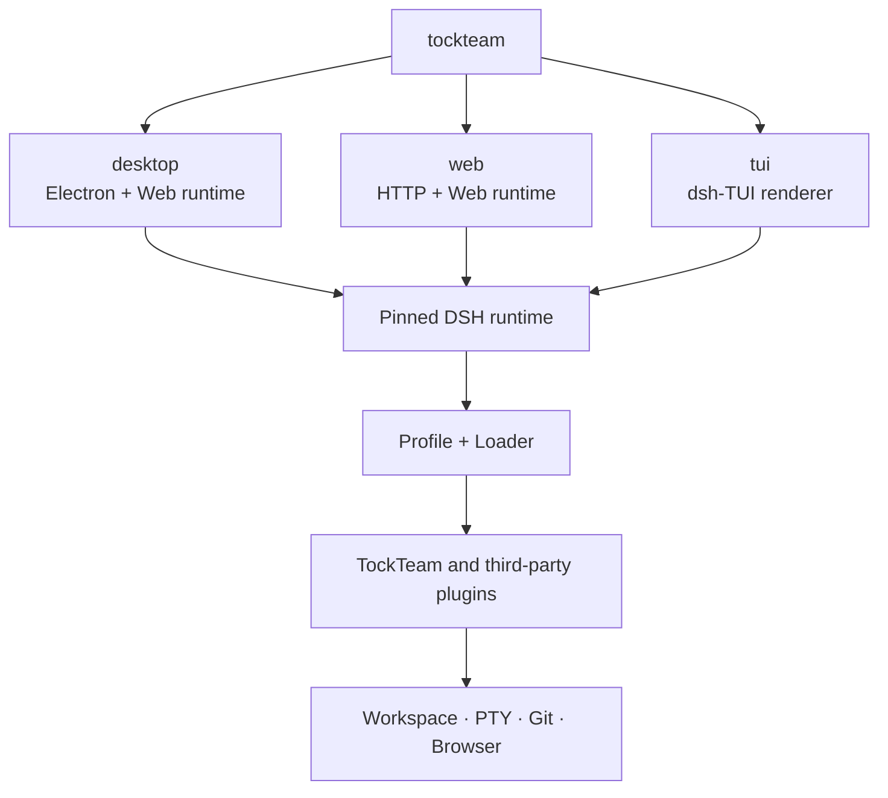
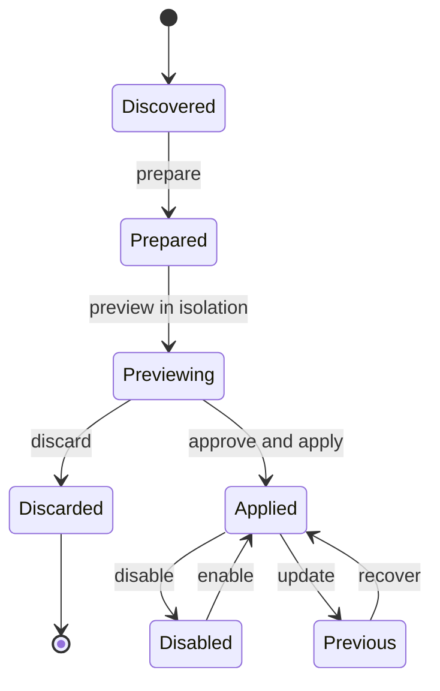

# TockTeam Architecture and Plugin Boundaries

## Goals

TockTeam provides Desktop, Web, and TUI over one pinned DSH runtime.
The surfaces share sessions, Profiles, plugin contracts, and local
capabilities, while each package carries only the interaction layer it needs.
Lightweight deployments do not have to install Electron.

Design principles:

- Reuse DSH Profile, Loader, locale, settings, and ThemeService contracts.
- Desktop is the full distribution; Web and TUI can be packaged separately.
- Keep one Host and one permission boundary for each capability.
- Human and Agent plugin actions share the same preview and commit transaction.
- Synchronize upstream features without replacing the TockTeam UI or themes.

## Surface architecture

`tockteam` only selects an interaction surface. Runtime capabilities remain
under DSH Profile and Loader management, so separate packages never create a
second plugin system.

## Distribution boundaries

| Package | Includes | Excludes |
| --- | --- | --- |
| Full/Desktop | Electron, Web runtime, TUI, Node, bundled plugins, unified CLI | Nothing |
| Web-only | HTTP/Web runtime, Node, Web-compatible plugins, unified CLI | Electron and native window features |
| TUI-only | dsh-TUI renderer, Node, TUI-compatible plugins, unified CLI | Electron and browser UI |

Desktop itself uses the Web UI, so TockTeam does not ship a degraded
"Desktop-only" package. Web-only and TUI-only remove Electron; TUI-only is
the smallest supported distribution.

## Bundled plugins and upstreams

| Plugin | Relationship | TockTeam boundary |
| --- | --- | --- |
| `@tockteam/desktop` | Native | Unified entry, window, menu, bridge, and bundled-plugin registration |
| `@tockteam/better-sidebar-runtime` | Pins [`DSH-better-sidebar`](https://github.com/omdsh-dev/DSH-better-sidebar) | Builds the upstream Host for PTY, Files, Git, history, and commit diff |
| `@tockteam/sidebar` | Downstream Better Sidebar UI adapter | Reuses the Host while retaining TockTeam layout, icons, themes, Review, and comments |
| `@tockteam/panel-controls` | Downstream implementation of the `dsh-web-panel` interaction model | Unified Terminal dock without a separate Web Terminal install |
| `@tockteam/pinned-summary` | Native | Session summary, half-height card, and content-gutter management |
| `@tockteam/plugin-marketplace` | Adopts lifecycle ideas from `plugin-registry` and `dsh-hub` | One Loader, isolated preview, risk approval, TOFU source lock, and recovery |
| `@tockteam/skins` | Downstream implementation of the `dsh-skins` ThemeService model | One skin id set, Host persistence, Web/Desktop CSS, and TUI palette adapters |
| `@deepseek-harness-tui/dsh-tui` | Pins [`dsh-TUI`](https://github.com/ccch1mneyyy/dsh-TUI) | Upstream owns terminal rendering, session interaction, commands, and terminal compatibility |
| `@tockteam/tui` | Downstream Profile adapter for `dsh-TUI` | Unified `tockteam tui`, TockTeam TUI identity, defaults, packaging, and DSH data boundary |

Downstream plugins periodically inspect upstream features and adapt them to
the current DSH contracts. Upstream code, the TockTeam UI, and final permission
boundaries remain separate layers.

`@tockteam/skins` is the only skin-definition module for all three surfaces.
Web and Desktop adapt the catalog to DSH CSS tokens; TUI adapts the same ids
to the upstream native `/theme` palettes. TUI retains upstream hot switching
and its picker, then mirrors the choice into the shared `skins.json` on the
next launch. There is no second theme loader.

## Plugin installation transaction

`installed` and `enabled` are separate states. Installation and updates pin
the source and commit before entering an isolated preview. Only explicit
application changes the current Profile. Agent-initiated installs use the
same transaction and risk approval and cannot bypass the Loader.

## Installed TockLauncher evidence

The installed smoke supports a disposable macOS app and a Windows portable
archive built from the supported directory artifact, plus real Debian/AppImage
lanes on Ubuntu. Current post-fix evidence has not been captured, so every
installed-evidence catalog row remains workflow-required. The smoke requires
exact identity/version/resources, renderer security, lifecycle and cleanup
reports before a row can be promoted. Vendor results are explicitly bounded
no-follow scans, not global source-absence proof. No workflow configuration
counts as a passing run or publication claim; signing, notarization, and public
distribution remain unproven. Any future local macOS row must be labeled
unsigned/internal macOS evidence and backed by a checked-in report. Windows and Linux installed evidence is workflow-required and not yet executed.

## Security boundaries

- Web binds to loopback by default; LAN exposure requires trusted authorities.
- Files, PTY, and Git requests are bound to the active Session and Workspace.
- Marketplace candidate, current, and previous states remain separate.
- A source receives a TOFU lock on first use; later commit changes need review.
- The Electron bridge exists only on Desktop; Web does not emulate its rights.
- TUI starts only on a real TTY and retains the active DSH Profile's sandbox
  and approval policies.

## Naming and data compatibility

User-facing names are **TockTeam Desktop**, **TockTeam Web**, and **TockTeam TUI**.
Internal package ids, the bundle id, and existing data directories remain
stable so upgrades preserve sessions, settings, and credentials.

See [installation, operations, and troubleshooting](./usage.md).
