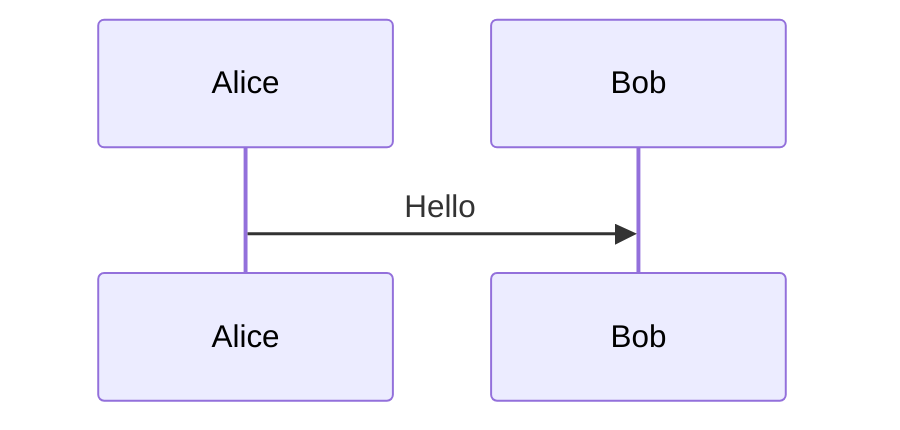
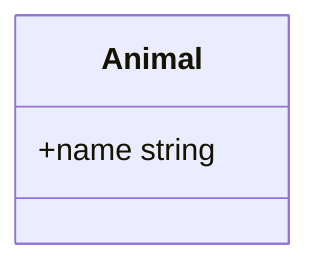
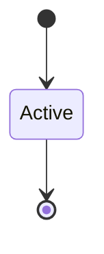
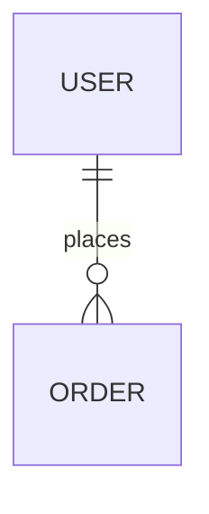
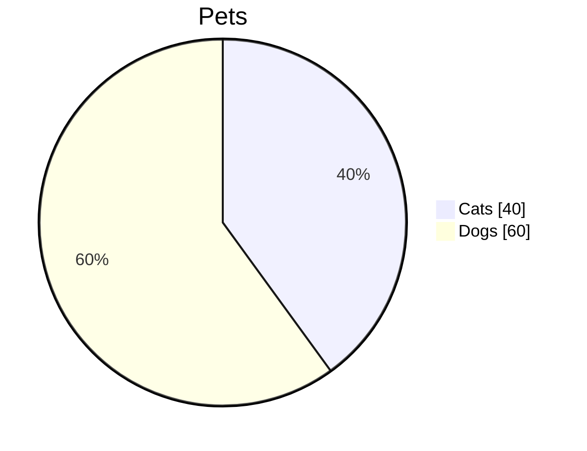
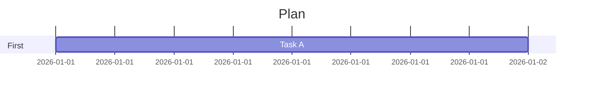
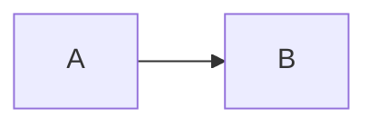

# Migration Diagrams

## Flowchart
```Mermaid
flowchart LR
  A[Start] --> B[Finish]
```

## Sequence


## Class


## State


## Relationship


## Pie


## Gantt


## Hostile Link (Must Remain Text)

