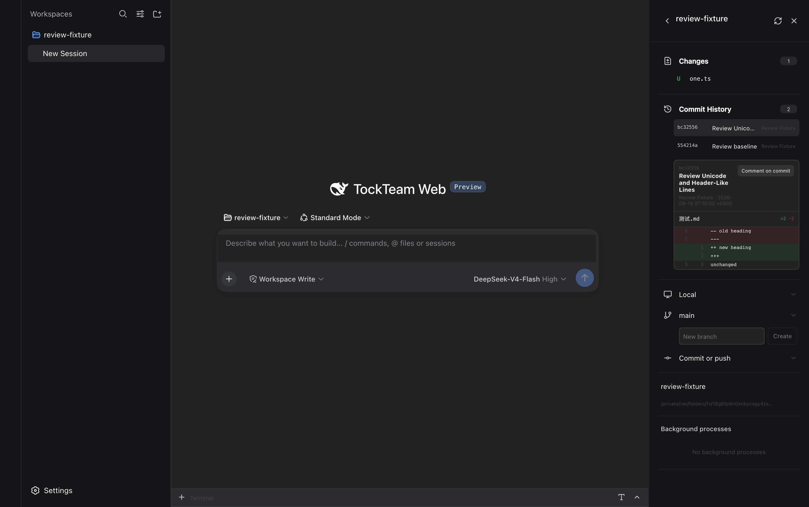

# TockCoder Review

## Scope

Reviewed the owned coding workbench, sidebar lifecycle and preferences, workspace authorization and Git adapters, review parsing/comments, terminal integration, input history, workbench navigation, and Desktop settings handoff. Preserved the pinned upstream packages and session/workspace authorization boundaries. This is a focused code review, not a certification of every upstream dependency.

## Findings Fixed

1. **P1 — Browser crash on quoted Git paths.** `plugins/sidebar/src/client/review-diff.ts:18` used Node `Buffer` in browser code. Quoted Unicode filenames crashed commit review. Replaced it with browser-native encoding/decoding and added a regression without Node globals.
2. **P2 — Incorrect diff contents and line references.** The same parser treated hunk lines beginning with `+++`/`---` as file headers and omitted renames with only one quoted path. Parse hunk content before header metadata and accept either quoting form independently. Regression checks cover contents, counts, paths, and line numbers.
3. **P2 — Stale session restoration.** `plugins/sidebar/src/client/sidebar-service.ts:195` captured the selected session before asynchronous preference loading. Switching sessions during startup restored the wrong tabs; completing startup after disposal also published state. Read the current selection after loading and ignore disposed completions. Tests include persistence into the correct session.
4. **P2 — Stale workspace and diff responses.** `plugins/sidebar/src/client/plugin.tsx:1035` retained state across session/workspace changes and accepted late responses from previous file selections. Key the panel by its session/workspace scope, cancel obsolete reads, ignore canceled completions, and prevent overlapping refreshes. The browser regression deliberately releases stale responses after changing selection.
5. **P2 — Settings navigation reported success before mounting.** `src/desktop-settings-navigation.ts:24` treated an absent button as enabled, stopped retrying, and called `onOpened` without opening Settings. Require the trigger to exist; the regression verifies the eventual click and success notification.
6. **P3 — Upstream adapter used stale splice offsets.** `scripts/better-sidebar-upstream-adapter.mjs:22` computed route offsets before removing an import, then sliced the shortened source with those offsets. Slice before removing the import. A regression verifies the neighboring Host routes remain byte-for-byte intact.

## Verification

- Baseline focused checks: 60 passed. New regressions were exercised against the unfixed behavior before implementation.
- Final focused checks: **95 passed**:

```sh
node --test tests/workspace-tools.test.ts tests/review-diff.test.ts tests/sidebar*.test.ts tests/terminal-*.test.ts tests/composer-*.test.ts tests/input-history.test.ts tests/tocktutor-route.test.ts tests/launcher-workbench-navigation.test.ts tests/launcher-specialists.test.ts tests/desktop-settings-navigation.test.ts tests/plugin.test.ts tests/right-panel-layout.test.ts tests/request-trust.test.ts tests/pinned-summary*.test.ts
```

- `node --test tests/tockcoder-panel.test.mjs`: **1 passed**, real Chromium component harness with delayed workspace/diff responses, scope changes, and runtime-error assertions.
- `pnpm run typecheck`: passed.
- `pnpm run build`: passed; staged runtime refresh also passed.
- `git diff --check`: passed.
- React Doctor, sidebar package: **68 → 69**, warnings **15 → 9**. Remaining structural warnings were not used as justification for speculative refactoring. The new loading-reset warning concerns a cancellation guard inside `finally`.

### Live Web Proof

A temporary Git workspace was registered through the real workspace API, then a new session and Review panel were opened through the UI. Verified commit `bc32556`, file `测试.md`, all five expected diff rows, correct addition/deletion counts, and an inline comment appearing as `@1 comment` in the message composer. No model call was sent. The native directory picker is not claimed as verified.

- Route `/`, TockTeam Web, expanded commit review; dark appearance, no skin.
- CSS viewport **1512 × 949**, device scale **2**, PNG **3024 × 1898**.
- `document.documentElement.style.colorScheme === 'dark'`; `dataset.tockteamSkin` absent.
- Playwright console reported **0 errors and 0 warnings** after the complete flow.
- Only the inspected screenshot below was published. Geometry and checksum are recorded in the adjacent proof JSON.



All launched Web/browser verification processes were stopped. Web wrapper/runtime PIDs 66675/66752, Playwright group 66805, and final regression browser PID 68338 were confirmed absent; the Web wrapper additionally reported `CLEANUP VERIFIED` after process-tree cleanup.

## Verification Limits

- `pnpm test`: **1,343 passed, 2 failed, 18 skipped**. Failures are outside the changed code: TockTutor's frozen-lockfile setup reports `ERR_PNPM_OUTDATED_LOCKFILE`, and the trusted-Raycast readiness test cannot resolve `jsdom` from the TockTutor workbench. No dependency or lockfile changes were made to hide these failures.
- `TOCKTEAM_LAUNCHER_INACTIVE_VISUAL_PROOF=1 CI=1 pnpm test:launcher:electron`: blocked before application boot with **“Inactive visual proof requires authenticated parent IPC.”** Consequently the Desktop settings change has focused unit coverage, not a passing live Desktop proof. No foreground-control workaround was attempted; the smoke cleaned up and no coder Electron process remained.
- The smoke regenerated tracked TockTutor build outputs. These were clean immediately before that command; the TockTutor owner confirmed no ownership of paths in this checkout. Only those identified generated outputs were discarded; unrelated source and the separate TockTutor checkout were untouched.
- Installed smoke was not run after these broader gates failed. No push or commit was made under the current conservative branch profile.

Beads: `tockteam-5ub`.
