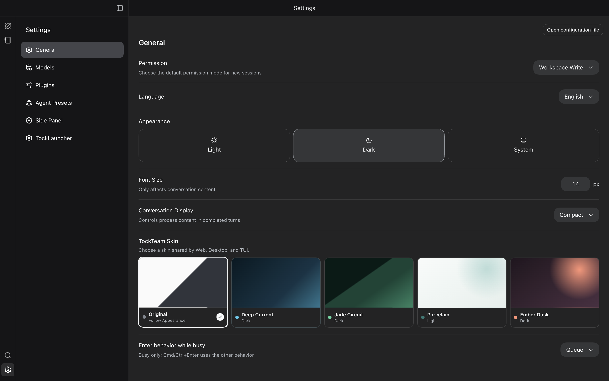
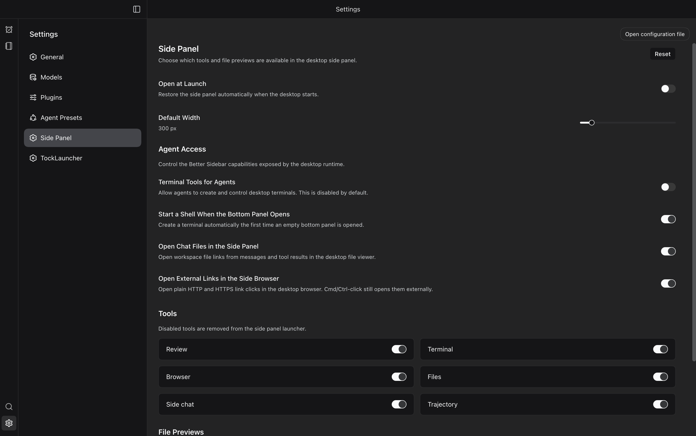
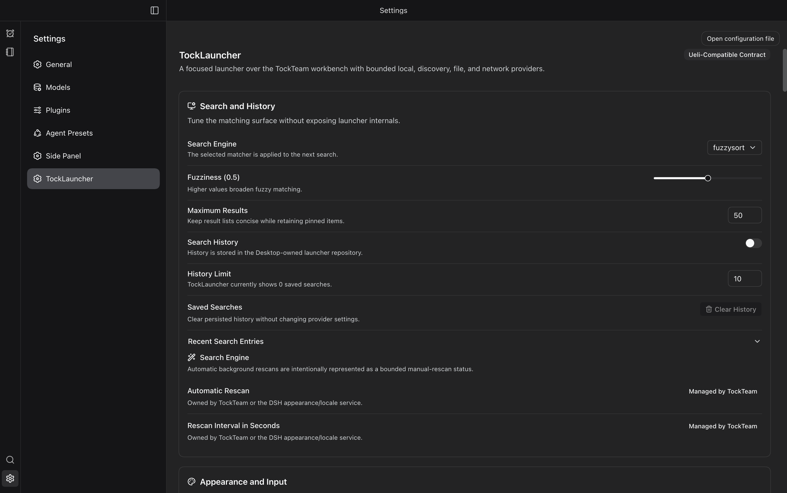

# Local PR Verification

## Scope

The owner approved including **all committed changes** from `origin/main` (`fe080d15`) through `7c4c5bbb`, not only the settings migration. This includes the settings design/shadcn work, earlier sidebar/workspace/review hardening, launcher persistence/workflow fixes, TockTutor import BOM/ZIP validation fixes, and macOS tray sizing.

No DSH pin, upstream source, or GitHub workflow file changed. The pre-existing edit to `.agents/uiux/settings/settings.html` remains uncommitted and excluded; its SHA-256 before/after verification is `48a8c4c40cb62d53a34bb9835e2207da44f87714a341c0c417c4accc44a06a46`.

## Independent Feature Verdict

**Works within the exercised Settings scope.** A fresh read-only verifier drove the real isolated Desktop app through app-scoped Playwright/CDP:

- Inspected General, Models, Plugins, Agent Presets, Side Panel, and TockLauncher, including all three Plugins tabs.
- Used arrow keys and Space to select Deep Current and restore Original; verified built-in dark appearance with no active skin afterward.
- Changed Open at Launch and Default Width (300 → 310 px), navigated away/back, confirmed persistence, then restored the original values.
- Changed Fuzziness (0.5 → 0.6), navigated away/back, confirmed persistence, then restored 0.5.
- Edited a Base64 prefix, collapsed its group, confirmed the input was hidden without losing its value, reopened it, and restored the original prefix.

The first delegated run reached its deadline; the same retained verifier resumed and completed. The interactive session's screenshots were only 1512 × 949 device pixels despite its reported DPR, so those images were **not published** as 2× evidence. Parent-run dedicated Electron proofs subsequently passed their native PNG-dimension assertions. The published screenshots below come only from those dedicated proofs.

The independent session observed the separately tracked startup error `workspaces.startSession is not a function` (`tockteam-0ecj`) before the settings flow, plus Electron's development CSP warning. It reported no new interaction errors. The later dedicated real-Desktop capture reported empty `errors` and `failures` arrays. This is not a claim that the existing startup defect is fixed.

## Local Checks

Host: macOS arm64, Node 24.21.0. Every command below passed:

```sh
node --test tests/shadcn-migration.test.ts tests/ui-ref-contract.test.ts tests/better-sidebar-git-actions.test.mjs tests/better-sidebar-git-paths.test.mjs tests/better-sidebar-session-scope.test.mjs
pnpm --filter @tockteam/ui run typecheck
pnpm run typecheck
pnpm run typecheck:tocktutor
pnpm test
pnpm run test:tocktutor
pnpm run build:tocktutor
pnpm run build
node scripts/tocktutor-build-manifest.mjs --check
node scripts/stage-dsh.mjs --quick
node scripts/settings-design-electron-proof.mjs
node scripts/settings-layout-electron-proof.mjs
node scripts/launcher-tray-smoke.mjs
pnpm run smoke:runtime
TOCKTEAM_WEB_OPEN=0 pnpm run smoke:web
pnpm run test:ueli-package-feasibility
pnpm run audit:ueli-package-feasibility
gitleaks git --log-opts='origin/main..HEAD' --redact
git diff --check origin/main...HEAD
```

- Root suite: **1,374 passed, 18 skipped, zero failures**.
- Focused UI/Host-adapter suite: **49 passed**. Package-feasibility suite: **10 passed**.
- Nested TockTutor types/tests/build and the tracked build manifest passed without changing tracked generated outputs.
- Desktop/Web runtime smokes verified plugin composition, bounded workspace operations, Git history/diffs, and terminal PTY execution. Web verification used HTTP only, not a standalone browser.
- Native tray smoke measured a 34 × 30 menu-bar slot across two create/destroy cycles.
- Secret scan examined 17 non-merge commits and found no leaks.
- Electron component proof covered all six palettes and keyboard/pointer/focus/draft behavior. Real Desktop proof covered eight views with matching title origins, 1512 × 949 CSS at 2×, built-in dark theme, and no active skin.
- All owned app/server/browser trees were stopped. Both independent-session focus checkpoints reported zero focused windows. An unrelated `tutor-integrity` browser session was left alone.

Logs: `/tmp/tockteam-pr-local-checks.I5lxsI`.

## Published Evidence

Only these three allowlisted images were copied transactionally from the final real-Desktop proof. All are native **3024 × 1898 PNGs**; dimensions and SHA-256 hashes are recorded in [proof.json](2026-09-21-pr-local-verification/proof.json). The same proof records all eight inspected views; the other five images remain in its temporary evidence directory and in the earlier committed settings gallery.







## Limits and CI Policy

- This is local macOS arm64 verification, not a replacement claim for Linux, Windows, macOS x64, Nix builds, or packaged/installed release certification.
- The full foreground launcher smoke and installed smoke were not run. The foreground launcher harness can show/focus windows and does not establish the authenticated inactive-proof IPC used by the settings harness; no foreground-control permission was requested or assumed. Native tray, hidden Desktop settings, runtime integration, and launcher unit regressions were used instead.
- The independent UI verifier did not exercise native import/export dialogs, marketplace approval/apply, credential saves, preset editing, or every earlier feature. Their available automated regressions ran locally; manual coverage is not claimed.
- Per the owner's request, the PR-head documentation commit carries `[skip ci]`. No repository-wide Actions settings or protection rules were changed, and no workflow is manually dispatched. Required checks may remain pending when GitHub skips CI; this PR does not request merging around such requirements.
