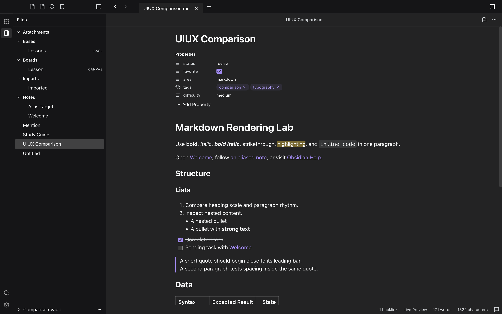

# TockTutor explorer navigation

Captured 2026-09-19T03:15:37.713Z. Beads: tockteam-s9s.

The supplied Obsidian main-editor reference makes the active note and folder structure easier to scan. TockTutor already exposed aria-current=page but its Tailwind aria-current variant targets true, leaving the active file transparent. Corrected the exact-value selector, shortened visible document names, kept full paths in accessible labels and hover text, retained BASE/CANVAS type cues, and added nesting guides and compact rows. Removed decorative file/menu glyphs that had no independent actions.

The existing comparison page and screenshot collection had substantial uncommitted content-alignment work on entry. This capture is published separately to preserve those images and their matching hashes. It uses the same shared Markdown bytes. Only a link is added to the gallery.

## Evidence

The real staged Desktop app opened UIUX Comparison.md in Live Preview with the built-in dark theme and no skin. Viewport: 1512 × 949 CSS pixels, device scale 2, PNG: 3024 × 1898. Checked active-note styling before/after navigation, exact path identity, visible type labels, Enter to open, focus indication, folder collapse/expand and 1px nesting guides. Replacing just the active selector with the old selector made the background transparent; restoring the production selector restored the highlight before capture.

Both launched Electron/runtime process trees were stopped and verified absent before the allowlisted screenshot/proof/report directory was atomically published. No focus-proof faults.

## Validation

- RED: pnpm -C plugins/tocktutor/packages/tockteam-tocktutor-workbench exec vitest run tests/route-panel-controls.test.tsx --environment jsdom -t 'readable explorer' — failed before implementation.
- GREEN: pnpm -C plugins/tocktutor/packages/tockteam-tocktutor-workbench exec vitest run tests/route-panel-controls.test.tsx --environment jsdom — 53 passed.
- pnpm -C plugins/tocktutor/packages/tockteam-tocktutor-workbench run test:component — 426 passed across 13 files.
- pnpm -C plugins/tocktutor/packages/tockteam-tocktutor-workbench run typecheck — passed.
- pnpm run build:tocktutor; pnpm run build; node scripts/stage-dsh.mjs --quick — passed.
- npx -y react-doctor@latest plugins/tocktutor/packages/tockteam-tocktutor-workbench --verbose --diff — 79/100, no reported issues in the selected changed-file scan (not a repository-wide clean bill).
- node /tmp/tutor-explorer-verify.mjs — real Desktop Playwright checks and screenshot passed.

## Limitations

The known TockCoder startup error (workspaces.startSession is not a function) and Electron development CSP warning occurred before the TockTutor workflow. They remain recorded and are not fixed by this change. Monitored TockTutor page errors, console errors and unhandled rejections were empty.

Obsidian's persistent sidebar search remains a separate candidate for a later run; it preserves reading context more effectively than the current TockTutor search modal. This run addresses explorer orientation only.
