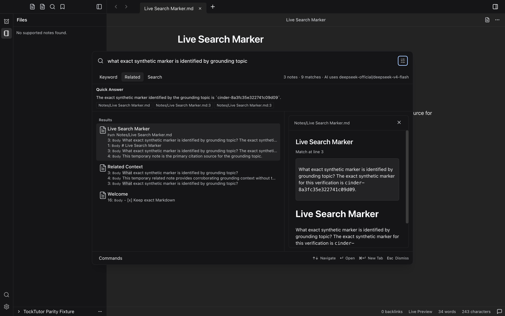

# TockTutor Search Verification

## Results

- **Live Search:** Official DeepSeek Related results and Quick Answer passed through the actual staged Desktop consumers, using synthetic notes. The answer contained a marker absent from the question. Three citations were validated; opening a line-3 citation selected the supporting source and focused the editable CodeMirror editor.
- **Capture:** 1512 × 949 CSS pixels at 2× scale; 3024 × 1898 PNG; explicit built-in dark theme with no skin. No captured runtime errors. Original capture commit: `7e6c8190`.
- **Installed Application:** One separate macOS arm64 installed-bundle smoke passed at `49e485c2207fe3c7ebc9aec9488c7ce610459fad`. Installed ASAR identity, isolation, settings persistence after reinstall, single-instance behavior, rollback, and complete cleanup passed. This is local ad-hoc-signed evidence, not notarized-release certification.
- **Regression Checks:** TockTutor install, typecheck, tests, build and manifest checks passed. Root typecheck, build and tests passed: 856 passed, 7 skipped, none failed. Post-install package-boundary checks passed 8 tests from their owning package directories.

## Harness Repair and Evidence Limits

The original live wrapper used a nonexistent timestamp executable. Three receipts remained empty, although the functional assertions and independent cleanup passed. Those historical receipts were not reconstructed, and no provider call was repeated merely to replace timestamps.

A new disposable wrapper uses `/bin/date`, stops before launch on setup failure, preserves child failures, surfaces postflight failures, and waits for child cleanup after a post-spawn receipt failure. Independent offline stub checks reproduced the original defects (RED exit 2) and passed the correction (GREEN exit 0). Stale intermediate patch records were retained privately; additive replacements reconstructed the corrected files exactly in both directions. Raw patches are omitted here because their context contains local operator paths.

The pinned workspace rebuild changed dependency paths and deduplicated bundled modules. Every old/new source-map source-content hash set was identical; see [the closure comparison](generated-source-closure.json). This is not a claim that bundle bytes are identical.

The screenshot precedes citation navigation; focus is DOM evidence, not an editor screenshot. Provider request limits are configuration evidence, not a measured HTTP-request count. Historical early offline retry cleanup remains unverified and is not attributed to either fully cleaned successful run. Canonical gallery images and their earlier proof remain unchanged.

See [the sanitized verification record](verification.json) for exact commands, source commits, hashes, cleanup, and independent review identities. Final PR-head CI and merge-conflict checks remain the remote acceptance gate.
