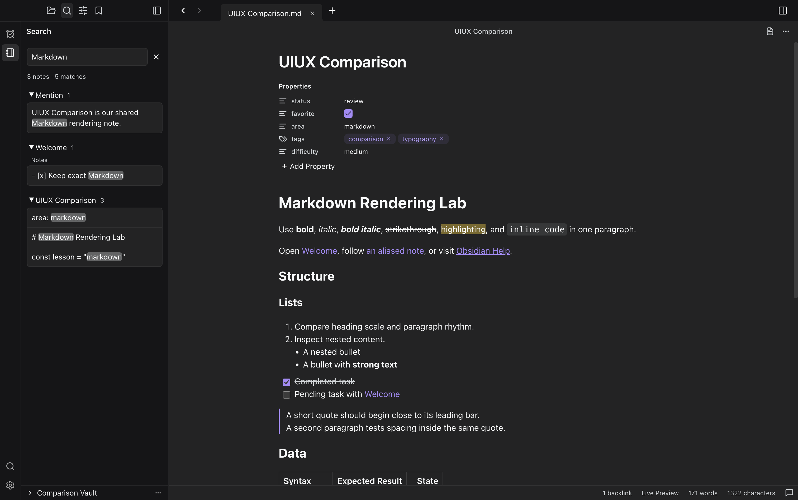

# Persistent vault search beside the note

Beads: tockteam-yfw. Captured 2026-09-19T03:36:58.125Z.

The supplied Obsidian search screenshot keeps the note visible alongside grouped results. TockTutor's modal covered the note and forced readers to reopen search after following a result. Added a sidebar search button, grouped collapsible matches, individual line navigation, match highlighting, note/match counts, clear and empty/error/loading states, and Files/Search switching that retains the query. The existing search dialog and AI features remain accessible through the sliders button. Cmd/Ctrl-click opens matches in another tab. Sidebar keyword requests use their own cancellation scope so typing and note navigation can run together; stale results cannot survive query changes, closing search, vault reload, or transfer to the dialog.

[Compare with Obsidian](comparison.html). Prior gallery screenshots and their hashes are preserved because they belong to earlier uncommitted comparison work.

## Verification

- RED: `pnpm -C plugins/tocktutor/packages/tockteam-tocktutor-workbench exec vitest run tests/route-panel-controls.test.tsx --environment jsdom -t 'keeps grouped search matches'` failed before implementation (missing Vault Search sidebar).
- RED: `node --test --test-name-pattern='sidebar search preserves' plugins/tocktutor/packages/tockteam-tocktutor-workbench/tests/route.test.ts` reproduced navigation cancellation before the independent search scope.
- `pnpm -C plugins/tocktutor/packages/tockteam-tocktutor-workbench run test:component`: 431 passed across 13 files.
- `node --test plugins/tocktutor/packages/tockteam-tocktutor-workbench/tests/route.test.ts`: 88 passed.
- Workbench typecheck/build, root `pnpm run build`, `node scripts/stage-dsh.mjs --quick`, build-manifest verification, and `git diff --check`: passed.
- `node --test tests/tocktutor-gallery.test.ts tests/tocktutor-content-alignment.test.ts`: four passed.
- React Doctor changed-file scan: 79/100 before and after. Three maintainability warnings remain: the large route view in source/generated output and the new result renderer. The index-key warning was fixed with stable match identities; no diagnostic was suppressed.
- `node /tmp/tutor-sidebar-search-verify.mjs`: real staged Desktop Playwright/CDP interaction and capture passed. Also inspected the app with a named playwright-cli session, detached and stopped.

The proof verifies 1512 × 949 CSS pixels, 2× device scale, 3024 × 1898 PNG, built-in dark theme, no active skin, UIUX Comparison.md in Live Preview, and identical shared Markdown bytes. It records five matches across three notes; keyboard focus and Enter navigation; collapse/expand; exact source-line 42 selection; Files/Search retention; empty query and clear/focus; and the retained advanced dialog. All launched app/runtime process trees were stopped and verified absent before this allowlisted screenshot/proof/report/comparison directory was published atomically.

## Limitations

No TockTutor runtime errors were observed during the checked flow. The existing TockCoder startup workspaces.startSession error and Electron development CSP warning remain. Advanced filters and AI search stay in the dialog. Search state is retained during the current workbench session, not across application restarts. This run did not commit or push.
