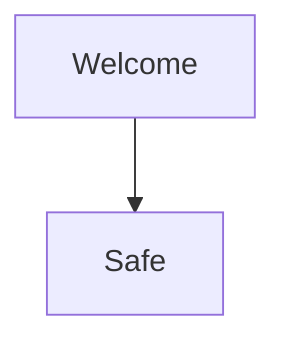

# Welcome ^welcome

This fixture links to [[Alias Target#Details|the alias note]] and embeds ![[../Attachments/pixel.png|16x16]].

- [ ] Review the lesson
- [x] Keep exact Markdown

> [!tip]+ Source Preservation
> Live Preview must keep this callout editable.

| Topic | Score |
| :--- | ---: |
| Safety | 3 |

Inline math `$1 + 1 = 2$` and a footnote reference.[^proof]

%% Hidden comment with [[Ignored Link]]. %%

[^proof]: This definition stays readable and inert.
